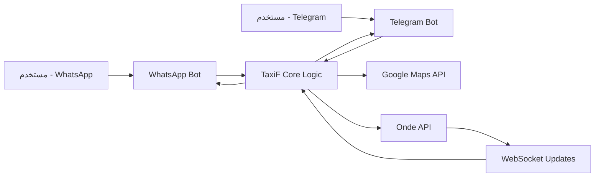

# 🚖 TaxiF Bots (Telegram & WhatsApp)

<div align="center">


**منصة طلب سيارات الأجرة عبر الرسائل النصية - متعددة المنصات**

[](https://www.python.org/)
[](LICENSE)
[](https://github.com/achraf-mehloul/TaxiF)

</div>

## 📖 جدول المحتويات
- [🎯 المقدمة والهدف](#-المقدمة-والهدف)
- [✨ المميزات الرئيسية](#-المميزات-الرئيسية)
- [🏗️ هيكلة المشروع والبنية التحتية](#️-هيكلة-المشروع-والبنية-التحتية)
- [⚙️ متطلبات التشغيل](#️-متطلبات-التشغيل)
- [🚀 دليل التنصيب والتشغيل](#-دليل-التنصيب-والتشغيل)
- [🔧 تكوين الإعدادات (Configuration)](#-تكوين-الإعدادات-configuration)
- [📋 دليل الاستخدام](#-دليل-الاستخدام)
- [🔌 واجهة برمجة التطبيقات (API Integration)](#-واجهة-برمجة-التطبيقات-api-integration)
- [🧪 الاختبار والتطوير](#-الاختبار-والتطوير)
- [❓ الأسئلة الشائعة (FAQ)](#-الأسئلة-الشائعة-faq)
- [📄 الرخصة](#-الرخصة)
- [👨‍💻 المطور](#-المطور)

---

## 🎯 المقدمة والهدف

مشروع **TaxiF** هو حل متكامل ومبتكر يسمح للعملاء بطلب سيارات الأجرة مباشرةً من خلال تطبيقات المراسلة الشهيرة مثل **WhatsApp** و **Telegram**، دون الحاجة إلى تنزيل أو تثبيت تطبيق منفصل.

يعمل النظام من خلال التكامل مع منصة **Onde API** المهنية لإدارة خدمات النقل، مما يضمن موثوقية عالية وتجربة مستخدم سلسة تشبه تطبيقات الطلب الشهيرة.

---

## ✨ المميزات الرئيسية

- **📱 واجهة متعددة المنصات**: دعم كامل لكل من **WhatsApp** و **Telegram** من قاعدة كود واحدة.
- **🧠 ذكاء اصطناعي متقدم**: معالجة طلبات المستخدمين بذكاء وسهولة.
- **🗺️ تكامل خرائط Google**: تحديد الموقع تلقائيًا، حساب المسافات، والعثور على أفضل المسارات.
- **⚡ تحديثات فورية**: استخدام **WebSockets** لاستقبال التحديثات المباشرة عن حالة الطلبات (مثل: تم قبول الطلب، السائق في الطريق، etc.).
- **💾 إدارة الجلسات**: تخزين مؤقت لبيانات المستخدمين لضمان تجربة حوار سلسة.
- **🔐 أمان عالي**: حماية البيانات والتواصل عبر بروتوكولات آمنة.

---

## 🏗️ هيكلة المشروع والبنية التحتية

```plaintext
TaxiF/
├── 0/                          # مجلد بوت WhatsApp
│   ├── whatsapp_bot.py         # نقطة الدخول والمنطق الرئيسي للبوت
│   ├── config.py               # إعدادات ومفاتيح API (يتم استيراده من المجلد الرئيسي)
│   ├── maps_api.py             # خدمات الخرائط و Geocoding
│   ├── onde_api.py             # wrapper للتعامل مع Onde API (طلبات، حذف، تحديث)
│   ├── storage.py              # إدارة状态 الجلسات والبيانات المؤقتة (في الذاكرة/قاعدة بيانات)
│   ├── websocket_listener.py   # عميل WebSocket للاستماع لتحديثات Onde في الوقت الحقيقي
│   └── requirements.txt        # تبعيات Python المطلوبة لهذا البوت
│
├── 1/                          # مجلد بوت Telegram
│   ├── bot.py                  # الكود الرئيسي للبوت (مبني على python-telegram-bot)
│   ├── config.py               # إعدادات البوت (وراثة من الإعدادات الرئيسية)
│   ├── maps_api.py             # تكامل خرائط Google (مشترك)
│   ├── onde_api.py             # تكامل Onde API (مشترك)
│   ├── storage.py              # إدارة الجلسات (مشتركة)
│   ├── websocket_listener.py   # listener لتحديثات WebSocket
│   ├── 1.py                    # ملف لأكواد مساعدة أو تجارب (يمكن دمجها لاحقًا)
│   └── requirements.txt        # تبعيات البوت
│
├── config.py                   # ملف الإعدادات الرئيسي (يورث للمجلدين الفرعيين)
├── main_requirements.txt       # قائمة التبعيات الأساسية المشتركة
└── README.md                   # هذا الملف
```

📊 مخطط انضام



---

## ⚙️ متطلبات التشغيل
🐍 Python: الإصدار 3.11 أو أعلى (مُختَبَر على 3.11.9 و 3.13.0).  
📦 مدير الحزم: pip (مرفق افتراضيًا مع Python).  
🌐 خدمات API خارجية:  
- حساب مفعّل على منصة Onde مع API Key صالح.  
- مفتاح Google Maps API مفعّل مع الخدمات: Maps JavaScript API, Places API, Directions API, Distance Matrix API.  
💻 نظام التشغيل: Linux, macOS, أو Windows.  

---

## 🚀 دليل التنصيب والتشغيل
1. استنساخ المستودع  
```bash
git clone https://github.com/achraf-mehloul/TaxiF.git
cd TaxiF
```

2. إعداد البيئة الافتراضية (Virtual Environment)  
```bash
python -m venv venv
source venv/bin/activate      # على Linux/macOS
venv\Scriptsctivate.bat     # على Windows (Command Prompt)
.env\Scripts\Activate.ps1   # على Windows (PowerShell)
```

3. تثبيت التبعيات  
```bash
pip install -r main_requirements.txt
cd 0 && pip install -r requirements.txt   # للواتساب
cd ../1 && pip install -r requirements.txt # للتلغرام
```

4. التهيئة والإعداد  
تعديل ملف `config.py` ووضع مفاتيحك (Onde API, Google Maps API, Telegram Token, WhatsApp API).  

5. التشغيل  
```bash
cd 1 && python bot.py        # تشغيل بوت Telegram
cd 0 && python whatsapp_bot.py # تشغيل بوت WhatsApp
```

---

## 📋 دليل الاستخدام
- **للمستخدم النهائي**: أرسل `/start` أو "مرحبًا"، ثم أدخل موقع الانطلاق والوصول وتابع التعليمات.  
- **للمطور/المسؤول**: راقب الـ Logs، واستعمل لوحة Onde للتحكم.  

---

## 🔌 واجهة برمجة التطبيقات (API Integration)
- **Onde API**: لإنشاء وإدارة الطلبات.  
- **Google Maps API**: للخرائط، المسارات، وحساب التكلفة.  

---

## 🧪 الاختبار والتطوير
- تفعيل `DEBUG=True` في `config.py`.  
- اختبار API باستخدام Postman أو curl.  

---

## ❓ الأسئلة الشائعة (FAQ)
- **401 Unauthorized** → تحقق من صحة `ONDE_API_KEY`.  
- **البوت لا يستجيب على WhatsApp** → تحقق من إعدادات الـ webhook.  
- **تغيير الرسائل** → عدل النصوص في ملفات `whatsapp_bot.py` أو `bot.py`.  
- **إضافة دفع إلكتروني** → يتطلب تكامل مع Stripe/Paypal.  

---

## 📄 الرخصة
المشروع مرخص تحت **MIT License**.  

---

## 👨‍💻 المطور
- **Achraf Mehloul** – المطور الرئيسي  
- 🌍 الجزائر  
- 💻 [GitHub](https://github.com/achraf-mehloul)  
- 📧 achrafmehloul50@gmail.com  

<div align="center">

شكرًا لك لاستخدامك TaxiF! 🚕  
اطلب بساطة، وصل بسرعة!  

</div>
